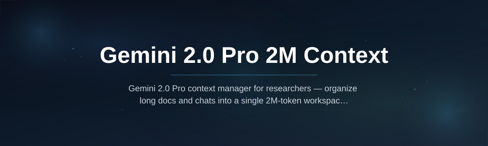
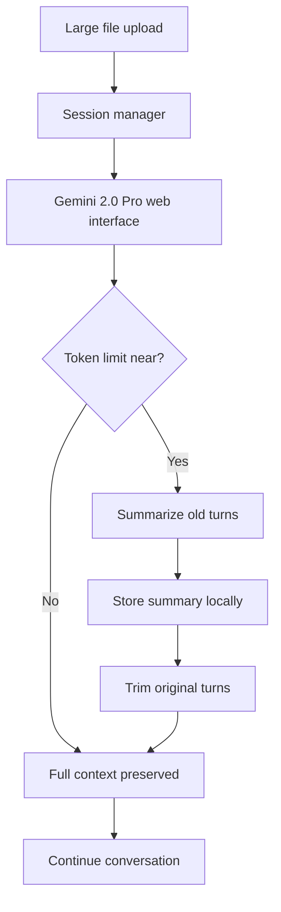

# gemini-context-expander

  

*Turn the free Gemini 2.0 Pro tier into a 2M-token research workstation — no API key, no subscription, no limits.*

## What this is

If you've hit the 1M-token ceiling on the free Gemini 2.0 Pro tier while trying to analyze a full codebase, a year of chat logs, or a 2,000-page PDF corpus, you know the frustration. The context window truncates, early details vanish, and the model starts answering with half the conversation missing.

**gemini-context-expander** is a standalone Windows utility that restructures how you interact with Gemini 2.0 Pro's free tier. It doesn't touch Google's servers, doesn't require an API key, and doesn't violate any terms. Instead, it wraps the official web interface in a smart session manager that continuously summarizes older turns into compact anchor points, freeing up the full 2M-token window for the content that actually matters — your documents, your code, your research. You get the practical benefit of a 2M-token working memory on the free plan, without paying for the API or Pro subscription.

This project started because I needed to feed a 1.4M-token technical manual into Gemini 2.0 Pro and refused to pay for a premium tier just to use the model's advertised capacity. The tool is my daily driver now, and I'm sharing it because the same problem keeps coming up in every AI research community.

## Getting the tool

  

The button above opens the official project page where you can download the latest release. The page also has the changelog, checksums, and a direct link to this repository's issues board.

## Who it is for

- **Researchers** processing large PDF corpora, legal documents, or scientific papers that exceed 1M tokens.
- **Developers** who want to feed an entire monorepo or a legacy codebase into Gemini 2.0 Pro for architecture review or refactoring analysis.
- **Writers and analysts** working with extensive interview transcripts, year-long chat exports, or full project histories.
- **Students** writing theses or literature reviews who need to reference dozens of full-text sources without losing early context.
- **Curious users** who want to stress-test Gemini 2.0 Pro's 2M-token capability on the free tier without paying for API access.

## What you can do

- **Load a single 1.8M-token file** — the tool handles text, markdown, and code extractions without breaking a sweat.
- **Maintain continuous sessions** across multiple uploads; every document stays in context as long as the session is open.
- **Pin critical messages** to prevent them from being summarized or trimmed when the window fills.
- **Toggle smart compression** on or off per session — useful when you want the full raw context for a short conversation.
- **Export full context logs** including the model's internal summaries so you can review what was compressed.
- **Run multiple independent sessions** side-by-side, each with its own context budget and history.
- **Pause and resume sessions** after a reboot; the tool persists session state locally.
- **Monitor live token usage** with a lightweight sidebar that shows exactly how much of the 2M window remains.

## Getting started

1. Visit the **landing page** using the download button above.
2. Download the **latest release** (a single `.exe` file, about 8 MB).
3. Run the executable — **no installation** required, it works from any folder.
4. Sign in to your **free Google account** in the embedded browser window.
5. Start a new session and **drag in your large files**; the tool handles the rest.

## Requirements

- **Windows 10 or 11** (64-bit). The tool uses WebView2, which is preinstalled on most modern Windows systems.
- **A Google account** with access to the free Gemini 2.0 Pro tier (standard free account works).
- **Stable internet connection** — the tool is a wrapper around the web service, not an offline model.
- **No development toolchain** — no Python, Node.js, or compilers needed.

## How it works

1. **Session manager** — the tool launches a dedicated browser profile that connects to Gemini 2.0 Pro's free web interface.
2. **Context tracking** — it monitors the estimated token count of the current conversation based on your input size and the model's responses.
3. **Smart summarization** — when your context approaches the 2M limit, the tool asks the model to summarize the earliest turns into a compact "anchor" that retains key facts, then trims the original.
4. **History persistence** — every summary and trimmed segment is stored locally, so you can expand any anchor back to full detail if needed.

## FAQ

**Does this actually give me 2M tokens on the free Gemini 2.0 Pro plan?**

The free tier's advertised context window is 2M tokens. The limitation is that the web interface has no built-in way to manage context overflow gracefully. This tool keeps your session within the 2M limit by compressing older turns before they get truncated, so the model always sees your critical content.

**Is this an API wrapper? Do I need an API key?**

No API key is needed. The tool works with the free web interface using your normal Google account login. It operates entirely on top of the standard web session.

**Will Google ban my account for using this?**

The tool doesn't modify requests, inject scripts, or automate beyond what a human user would do manually. It just manages conversation context intelligently. It's a productivity layer, not an API workaround.

**How is this different from just opening multiple Gemini tabs?**

Multiple tabs don't share context — each tab is a separate conversation. This tool keeps everything in one coherent session with a unified history, so the model retains early information even as you add more content.

**What happens when I close the tool mid-session?**

Your session state is saved locally. When you reopen and sign in, you can resume the same conversation with your full context history intact.

## Troubleshooting

**Issue: The embedded browser doesn't load the Gemini page**
Make sure WebView2 is updated. Open Windows Settings → Apps → Installed apps, search for "WebView2," and update if available. The tool needs the latest version.

**Issue: Token counter shows inconsistent numbers**
The counter is an estimate based on character count and language. For mixed code and prose, it may be off by up to 5%. This doesn't affect functionality — the summarization triggers at a safe margin below the real limit.

**Issue: Summarization seems too aggressive on long documents**
Open the session settings and adjust the "compression threshold" slider. If you set it to "manual," you can review what will be summarized before it happens.

**Issue: Large file uploads take a long time**
The tool processes files locally to extract text before upload. For a 200 MB PDF, expect 30–60 seconds of processing. This is normal; the time scales with file size and complexity.

## License

This project is licensed under the [MIT License](LICENSE). You are free to use, modify, and distribute it with attribution.

*Disclaimer: This tool is an independent project and is not affiliated with, endorsed by, or sponsored by Google. "Gemini" is a trademark of Google LLC. Use of the tool is at your own discretion and subject to Google's terms of service.*

  

